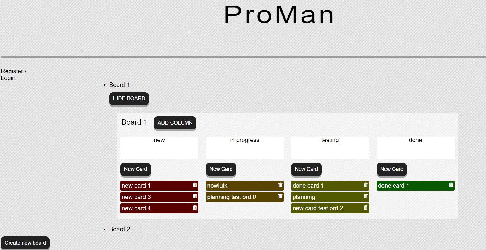
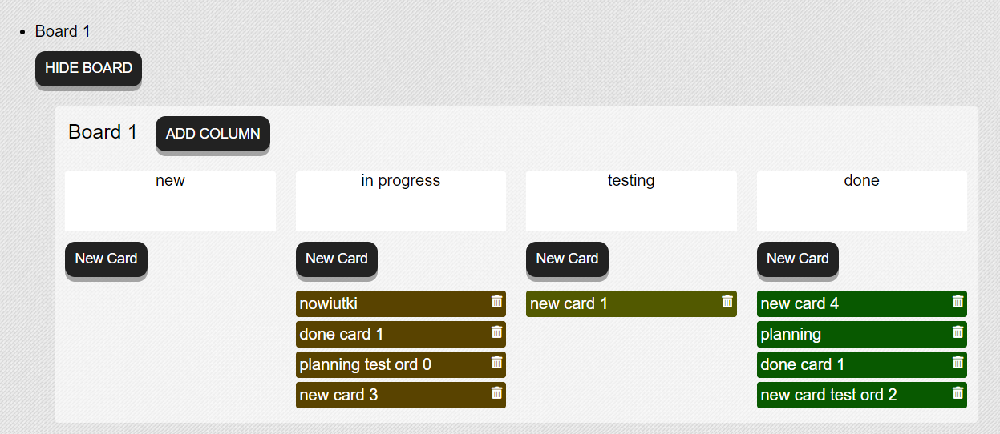

# ProMan (sprint 1,2)

_Project developed in November 2020. (Codecool course)_ 
_Developers: Joanna Rzeszótko-Doniec, Mateusz Rosiek_

## Project assumptions

- Users can add tables, cards, titles and rename them
- Users can move cards to other columns (the order is rearranged) 
- Private boards are available only for authors, that have to be logged in
- Tables, cards can be deleted
- planning the development of an advanced product

